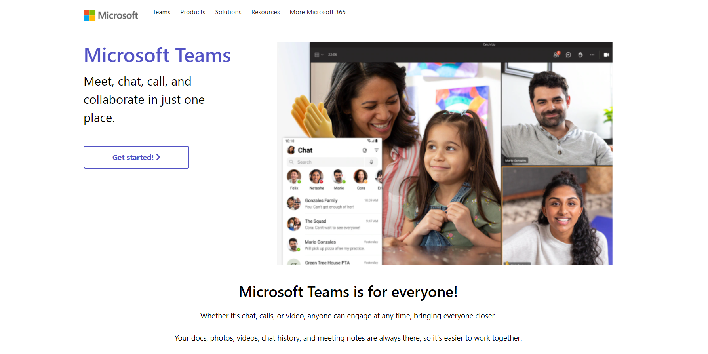

<h1 id="top" align="center"> Microsoft Team Clone</h1>

This is the "Microsoft Team clone" project under the program **Microsoft Engage 2021**. A free WebRTC browser-based video call, chat and screen sharing web app.

<br>


Introduction
------------

The aim of this project is to build  fully functional prototype with at least one mandatory functionality - a minimum of two participants should be able connect with each other using your product to have a video conversation.

## https://aditya20233.herokuapp.com/

<br>

[](https://aditya20233.herokuapp.com/)

## Features

- No download, plug-in entirely browser based
- All browser compatiable
- Fully Responsive (Mobile,Desktop ,Any devices)
- Google Authentication
- Unlimited number of conference rooms without call time limitation
- Multiple Participant can join the meet at same time
- Desktop and Mobile compatible
- Optimized Room Url Sharing (share it to your participants, wait them to join)
- WebCam Streaming
- Audio Streaming
- Screen Sharing to present documents, slides, and more...
- Recording your Screen and Video
- Chat with Emoji Picker & Private messages & Save the conversations
- Full Screen Mode on mouse click on the Video element

## Demo

- `Open`https://aditya20233.herokuapp.com/ 
- `Pick` your personal Room name and `Join To Room`
- `Allow` to use the camera and microphone
- `Share` the Room URL and `Wait` someone to join for video conference


## Quick start

- You will need to have [Node.js](https://nodejs.org/en/) installed
- Clone this repo

```bash
git clone https://github.com/aditya20233/microsoft-engage-2021-project.git
```

## Setup Turn

Not mandatory but `recommended`.

- Create an account on http://numb.viagenie.ca
- Get your Account USERNAME and PASSWORD
- Fill in your credentials


## Install dependencies

```js
npm install
```

## Start the server

```js
npm start
```

- Open http://localhost:3000 in browser

---
<p align="center"> Made by <a href="https://www.linkedin.com/in/aditya-lodhi-bb2212189/">Aditya Lodhi</a></p>
